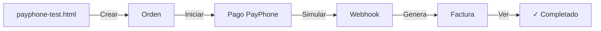

# ⚡ Quick Start - PayPhone SofiShop

## 🚀 5 Minutos para Empezar

### 1️⃣ Verificar Dependencias (30 segundos)
```bash
cd backend
npm install
```

### 2️⃣ Iniciar Servidor (30 segundos)
```bash
npm start
# ✓ Servidor en http://localhost:3000
```

### 3️⃣ Abrir en Navegador (1 minuto)

**Para testing rápido:**
- http://localhost:3000/payphone-test.html

**Para flujo real:**
- http://localhost:3000/cart.html

### 4️⃣ Crear Orden de Prueba (1 minuto)

En `payphone-test.html`:
1. Click "📦 Crear Orden"
2. Aparece Order ID

### 5️⃣ Procesar Pago (1 minuto)

Opciones:

**A) Pago PayPhone:**
```
1. Click "💳 Iniciar Pago PayPhone"
2. Click "✓ Simular Webhook"
3. ✓ Pago completado
```

**B) Pago Manual:**
```bash
curl -X POST http://localhost:3000/api/payments/webhook \
  -H "Content-Type: application/json" \
  -d '{
    "idTransaccion": "txn_test",
    "estado": "completado",
    "referencia": "PEGAR_ORDER_ID_AQUI"
  }'
```

---

## 🔧 Configuración PayPhone

**Ya está configurado en `backend/.env`:**
```env
PAYPHONE_APP_ID=0986346275
PAYPHONE_TOKEN=Sofia2022
PAYPHONE_COMERCIO_ID=0986346275
```

**Cambiar en Producción:**
1. Actualizar `.env` con nuevas credenciales
2. Reiniciar servidor: `npm start`

---

## 📊 Ver Resultado

### En navegador (Chrome DevTools - F12):
```javascript
// Ver órdenes creadas
fetch('http://localhost:3000/api/orders').then(r => r.json()).then(console.log)

// Ver estado de pago
fetch('http://localhost:3000/api/payments/estado/MONGO_ID')
  .then(r => r.json()).then(console.log)
```

### En MongoDB Compass:
1. Conectar a `mongodb://localhost:27017`
2. Base de datos: `sofishop`
3. Colección: `orders`
4. Ver orden con pago y factura

---

## 📁 Archivos Clave

```
backend/
├── config/payphone.js              ← Credenciales
├── services/payphoneService.js     ← Lógica de PayPhone
├── routes/payment.routes.js        ← Endpoints /api/payments/*
└── .env                            ← Variables

frontend/
├── checkout.html                   ← Interfaz de pago
├── payphone-test.html              ← Herramienta pruebas
└── cart.html                       ← Carrito actualizado
```

---

## 🧪 Flujo de Prueba Rápido



---

## ✅ Verificar que Funciona

### 1. Servidor corriendo
```bash
curl http://localhost:3000
# Debe retornar index.html
```

### 2. API disponible
```bash
curl http://localhost:3000/api/orders
# Debe retornar JSON
```

### 3. PayPhone configurado
```bash
curl http://localhost:3000/api/payments/estado/test
# Debe retornar error "Orden no encontrada" (normal)
```

---

## 🐛 Troubleshooting Rápido

| Problema | Solución |
|----------|----------|
| "Cannot find module" | `npm install` |
| Puerto 3000 ocupado | `lsof -i :3000` y matar proceso |
| MongoDB no conecta | `mongod` debe estar corriendo |
| .env no cargado | Reiniciar: `npm start` |
| payphone-test.html 404 | Verificar archivo existe |

---

## 📌 URLs Importantes

```
Frontend:      http://localhost:3000
Carrito:       http://localhost:3000/cart.html
Checkout:      http://localhost:3000/checkout.html
Test Tool:     http://localhost:3000/payphone-test.html
API Base:      http://localhost:3000/api
Payments API:  http://localhost:3000/api/payments
Orders API:    http://localhost:3000/api/orders
```

---

## 💡 Comandos Útiles

```bash
# Instalar dependencias
npm install

# Iniciar servidor
npm start

# Ver logs en tiempo real
pm2 logs

# Verificar conexión a BD
mongo mongodb://localhost:27017/sofishop

# Limpiar caché
rm -rf node_modules
npm install

# Testear API
curl -X GET http://localhost:3000/api/orders
```

---

## 🎯 Siguiente Paso

Después de verificar que funciona:

1. **Leer documentación completa:**
   - [PAYPHONE_INTEGRATION.md](PAYPHONE_INTEGRATION.md)

2. **Hacer testing real:**
   - [TESTING_GUIDE.md](TESTING_GUIDE.md)

3. **Para producción:**
   - [DEPLOYMENT_GUIDE.md](DEPLOYMENT_GUIDE.md)

---

## 📞 Si algo no funciona

1. **Ver logs:**
   ```bash
   npm start
   # Buscar error en consola
   ```

2. **Ver consola del navegador:** F12

3. **Contactar soporte:**
   - PayPhone: support@payphone.app
   - SofiShop: compras.sofishop@gmail.com

---

**¡Listo para empezar! 🚀**

Ir a: http://localhost:3000/payphone-test.html
